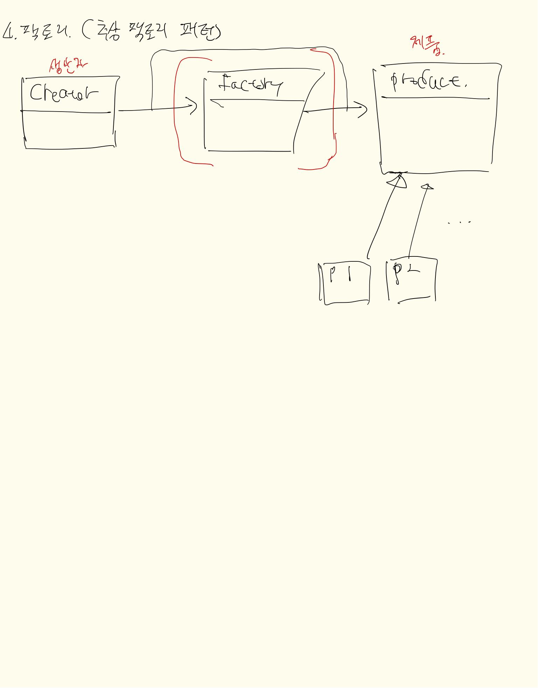
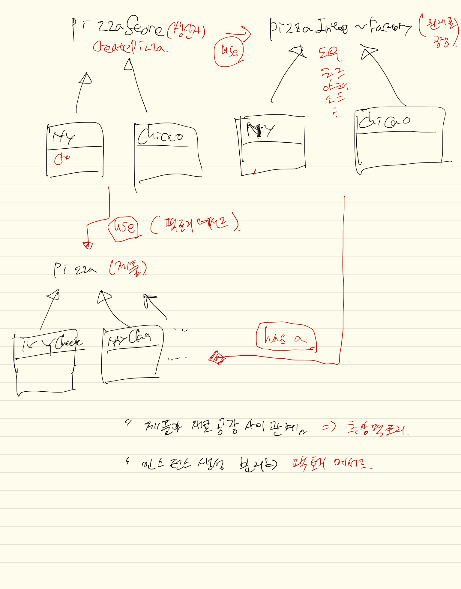

# 내용정리

## 정의
객체 생성과 관리를 분리하여 new를 통한 객체 생성을 클라이언트에서 명시적으로 하는 것이 아니라
팩토리 클래스나 메서드를 통해서 객체를 생성함
이때 팩토리 클래스는 생성과 사용하는 객체의 분리가 이루어지기 때문에(느슨한 결합) 유지보수가 편리해짐

1. 추상팩토리 패턴
 - 어떤 제품군을 생성할 때 형식에 맞춰서 구현하기 위함. 
 - 객체로 분리됨
 - 공장(원재료공장)은 제품(피자)과 `has a` 관계를 맺게 됨. (느슨한 결합)
    - 따라서 객체별 구현을 호출하는 부분에서 정할 수 있게 됨.
    - 피자를 생성할 때 인자 값을 `factory`에 따라 내용이 바뀜 (생성자 인자)
 - 팩토리를 생성하는 쪽(클라이언트 - PizzaStore)은 그 생성하는 부분에 맞게 다양한 추상팩토리를 호출 할 수 있음.
    - 여기에서 팩토리는 `싱글턴 구현 고려`
   
 
2. 팩토리메서드 패턴
 - 인스턴스 생성시 내부적으로 처리 (메서드형태)
 - 외부 호출하는 쪽 (클라이언트) 인스턴스 생성코드를 없앰
 - 보통 `조건문(if)`으로 분기 처리를 하여 인스턴스를 생성
    - 여기에서 `Stream API`의 `filter`메서드를 통해 간결화 시킬 수 있음
 

## 클래스다이어그램

