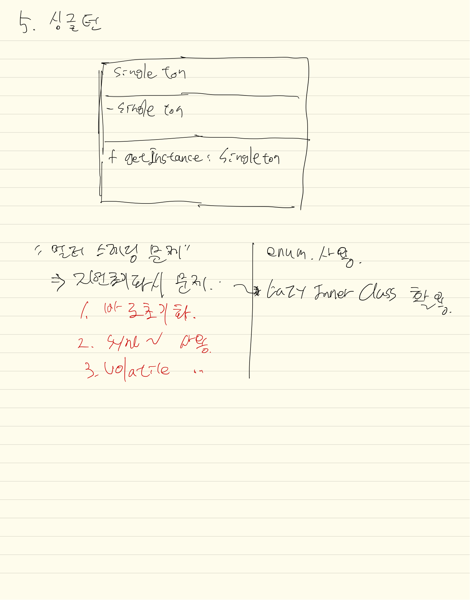

## 정의
싱글턴 패턴이란 객체의 `인스턴스가 1개`만 존재하게 구현하는 프로그래밍 기법.  
여러가지 방식이 있는데.. 그 이유는 성능, 안전성 등 때문

1. 기본방식
2. 지연초기화
3. 바로 초기화
 - 단점 보완 : static inner class 활용
4. 멀티스레딩 안전성확보 (동기화 - syncronized)
5. Enum을 활용 - 사용은 잘 안함

## 클래스다이어그램
