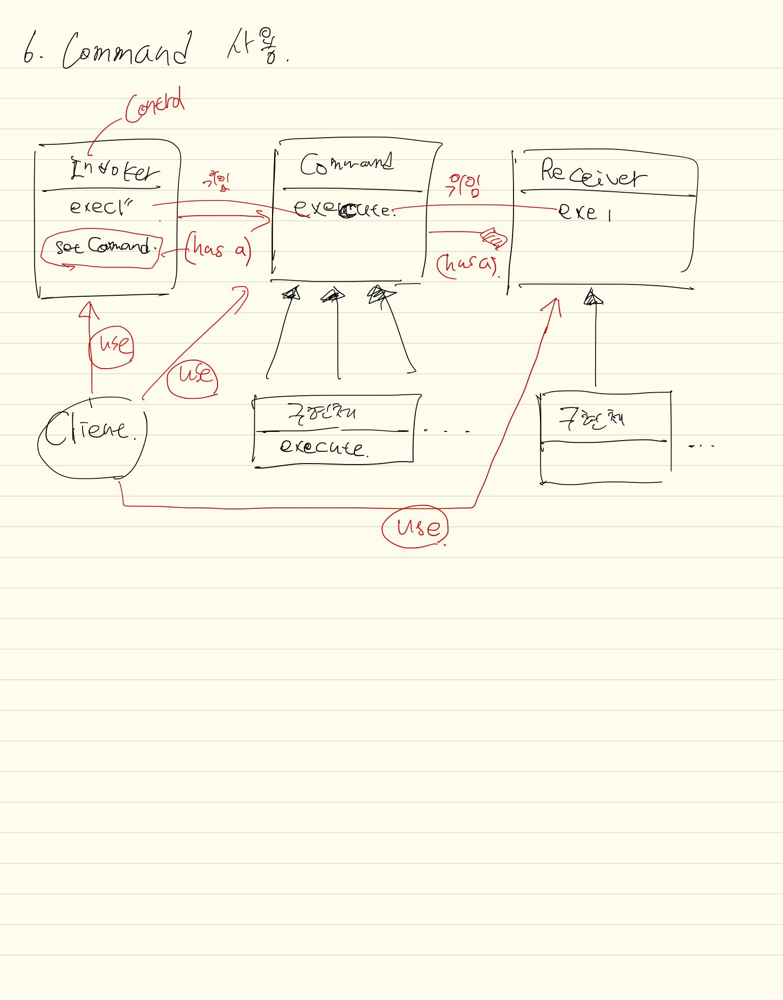

## 정의
호출캡슐화! 해야할 일을 전달(명령)하면 그 일을 알아서 수행. (캡슐화/모듈화)  
`명령실행 -> 커맨드 -> 명령수행` 각각 분리하여 명령을 내리기만하면 되고, 명령을 수행하기만 하면 됨.
`어떤 것`인지에 대해 **관심은 없음.**

`어떤 것을 요구하는 객체`와 `어떤 것을 받아서 수행하는 객체`를 분리시키는 패턴.

등장인물
1. 요구하는 객체 (인보커 - setCommand)
2. 요구를 전달만하는 커맨드 객체 (커맨드 - execute)
3. 요구를 수행하는 객체 (리시버 - execute 위임 메서드)

`요구사항을 객체로 캡슐화`, `델리게이션`을 통해 여러 요구사항을 설정 하고 사용할 수 있음.  
예로 `작업취소, 로그기록, 메세지 큐등 활용`

## 클래스다이어그램
