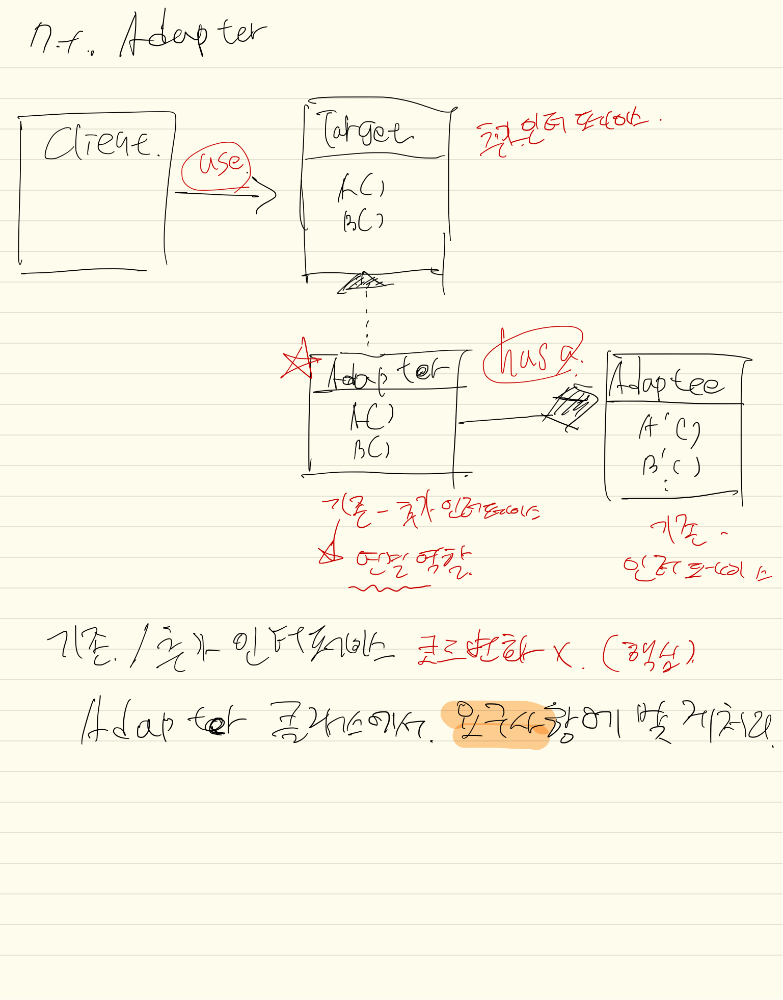

## 내용
기존 인터페이스에 +로 추가 인터페이스가 추가 되는 경우.  
**기존 인페이스는 소스코드 변경 없이** / **추가된 인터페이스 또한 변경 없이** 처리를 해야할 경우.

중개자 역할을 하는 **Adaptor**를 넣어서 연결 시켜준다. 이때 **Adaptor에서 입맛에 맞게 코드 구현을 해주며 되며,  
기존/추가 인터페이스는 코드변경이 없어야 한다.**

1. 객체 어댑터
    - 일반적인 **구성(has a~)** 관계를 통해 제어
    
2. 클래스 어댑터
    - 구성관계만 다르며, 하는 역할 및 내용은 같음
    - 다중상속이 가능한 경우
        - 어댑터 (하위클래스 역할)
        - 타겟과 추가인터페이스 (상위클래스 역할)
        - 어댑터(서브클래스)에서 중개자 역할을 함. (객체 어댑터와 동일) 
    
## 클래스다이어그램
타겟인터페이스(기존)와 어댑터는 구현관계, 어댑터와 어댑티(추가)는 구성관계.  
**타겟-어댑터-추가** 형태

