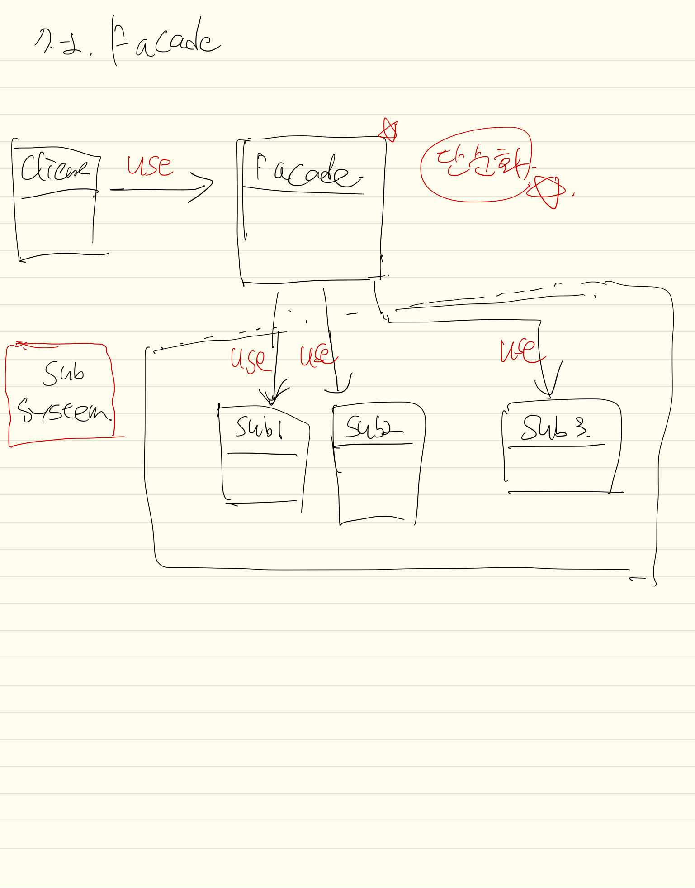

## 내용
복잡한 시스템을 **단순화** 시켜서 인터페이스 제공.
예를들어, 어떤 하나의 작업을 수행하기 위해서 10가지의 순서가 실행되어야 한다고 할 때, 사용자가  
10가지 순서를 전부 기억해서 호출하는 방식이 아닌, **퍼사드 패턴을 통해 중개자 인터페이스**를 두고 그 작업에 대한   
**public 메서드**를 제공함으로써 **사용자에게 단순하게 제공하는 패턴.**

실제 작업은 서브시스템에서 진행됨.  
그 복잡한 서브시스템 흐름을 **단순화**해서 제공해주는게 퍼사드패턴.

## 클래스다이어그램
**중개자 인터페이스(퍼사드)** 를 클라이언트에 제공하여 사용하도록 함.  
퍼사드 인터페이스 하위 시스템의 내용을 서비스 내용에 맞게 구현하여 정리.

