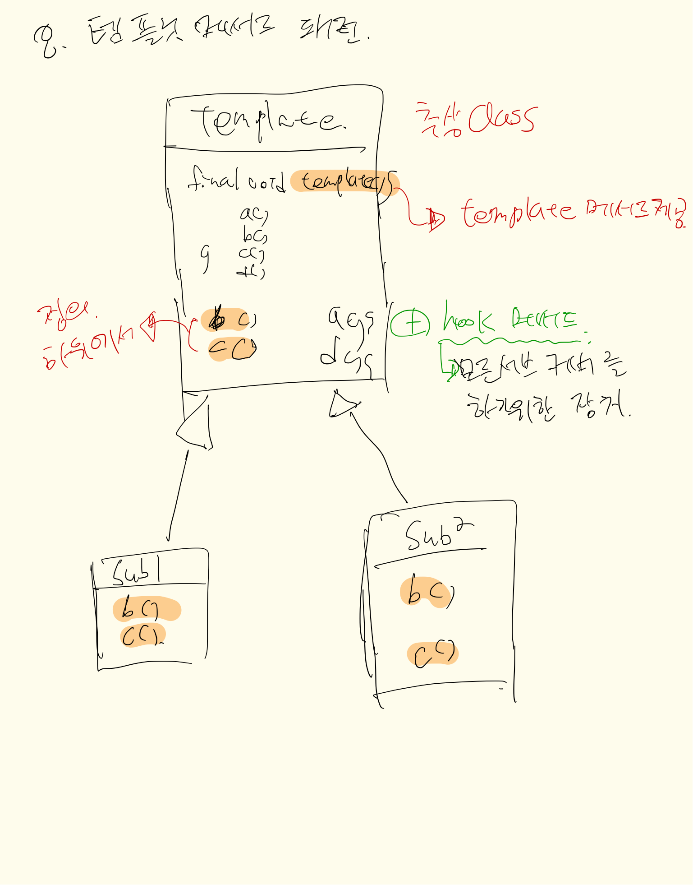

## 내용
템플릿 메서드의 기본적 사상은 상위클래스에서 `템플릿(틀, 알고리즘 순서)`을 제공해주고 그 템플릿의 내용은 `상위, 하위클래스의
구현 내용`을 채워서 때에 따라 `다형성`을 적용하여 실행되게 하는 것이다. 
이렇다 보니 상위와 하위의 의존성이 강한편이지만 코드의 중복성을 극대적으로 줄이고 코드 재사용성을 극대화 시킨 패턴이기도
한다.

템플릿 메서드의 대표적인 예가 `Arrays.sort()`이며, 교과서적 내용을 가져가진 않았다. 
템플릿메서드는 많이 사용되기 때문에 조금씩 변형된 클래스다이어그램을 갖지만 기본적인사상(템플릿제공->재사용성극대화)은 
변화지 않음을 기억하면 된다.

### 추가적으로 알아야 할 부분

- hook(후크)메서드
    ```
    후크메서드란 아무것도 정의되어 있지 않은 메서드를 의미한다.
    이런 장치가 필요한 이유는 서브클래스들이 일부 템플릿(알고리즘)에 딱 맞지 않고 다르게
    작용 될 수 있기 때문인데 상위 클래스에 hook 메서드를 둠으로써 서브클래스의 내용에 맞게
    hook 메서드를 오버라이딩을 하면 그 서브클래스의 잘 안맞는 부분을 깔끔하게 구현해낼 수 있다.
    
    다시 정리하면, hook메서드를 두는 이유는 상위클래스에서 제공하는 템플릿메서드의 틀이 서브에서 정확히 일치 하지
    않는 경우가 발생하는것을 적절히 제어하고 깔끔하게 프로그래밍하기 위한 장치라 보면 될 것 같다.
    ```
    
- 스트래티지 패턴과의 비교
    - 템플릿메서드 패턴
        - 알고리즘을 메서드로 제공 -> 서브클래스에서 내부구현의 일부를 정의하여 서브클래스별 실행을 제공 
        - 상속 기반  
    - 스트래티지(전략) 패턴
        - 알고리즘군을 만듬 -> Model이 사용할 알고리즘을 선택하여 `has a 관계`를 맺고 선택한 알고리즘 객체(전략)를 활용
        - 구성 기반
   
   
## 클래스다이어그램
