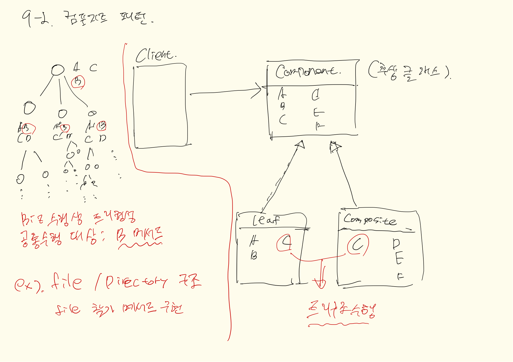

## 내용
개별객체와 복합객체를 통해 트리계층의 작업을 수행할 때 위주로 사용 되는 패턴
- 복합객체와, 단일(개별)객체, 상위 추상클래스
- 상위클래스 : 하위 클래스들이 해야할 작업 내용을 기술
- 개별객체 : 다른 객체를 포함하고 있지 않고 자신만 표현함  
- 복합객체 : 개별 객체와 다른객체를 포함시키는 복합객체
- 

 
### 추가적으로 알아야 할 부분
단일책임규칙이 위배되는 경우가 있지만, 상황과 필요에 따라서는 유연한 대체가 필요함
기본은 단일책임규칙을 통해 분리와 응집도를 높이는게 맞으나 지금처럼 상황에 따라서는 위배하여
코드의 중복성을 줄일 수 있다.

   
## 클래스다이어그램

