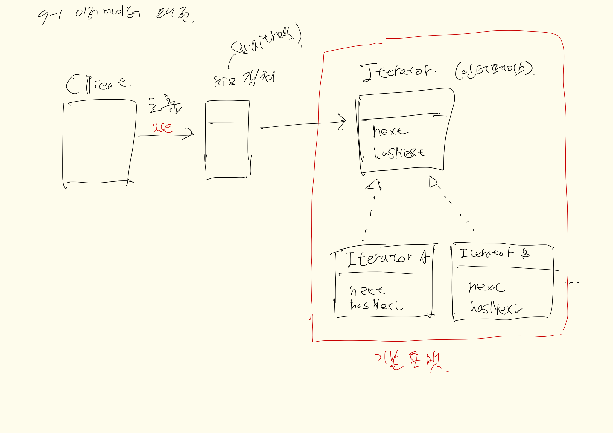

## 내용
- 반복잡업이 필요한 경우
- 클라이언트(호출하는 쪽) 노출시키지 않기 위함
- 반복패턴의 캡슐화를 통해 필요시 객체에서 구현만 하면 그 객체에 맞게 사용이 가능
- 인터페이스 구현을 통해 일괄된 작업을 할 수 있도록 함 (자료구조에 구애 받지 않게 해줌)
- 그래서 클라이언트에서 각 클래스에 대한 반복작업은 `Iterator`라는 통합된 인터페이스 사용법만 알면 동일 작업 수행가능

### 추가적으로 알아야 할 부분
- java 라이브러리 Iterator 패턴
- next, hasNext 구현
- remove 등 타 메소드는 옵션 구현

## 클래스다이어그램

