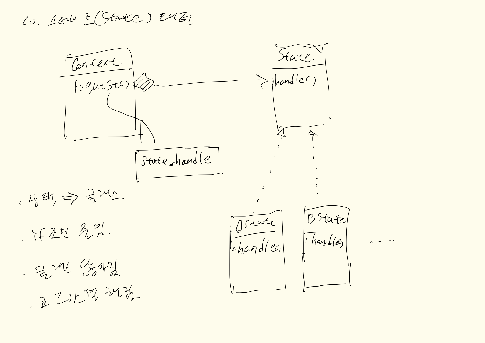

## 내용
어떤 상태를 표현하는 클래스 단위의 디자인패턴 입니다. 이런 상태들은 보통 어떤 코드값의 형태를 띄게 됩니다.   
예를들면 상품판매완료, 상품판매중, 상품준비중 등 이런 상태를 나타낼 수 있고, 그 상태에서 해야할 일들이 다소 복잡한 경우
**State 패턴을 활용하면 코드가 간결해집니다.**
**단점은 클래스의 수가 많아진다.**

   
## 클래스다이어그램

