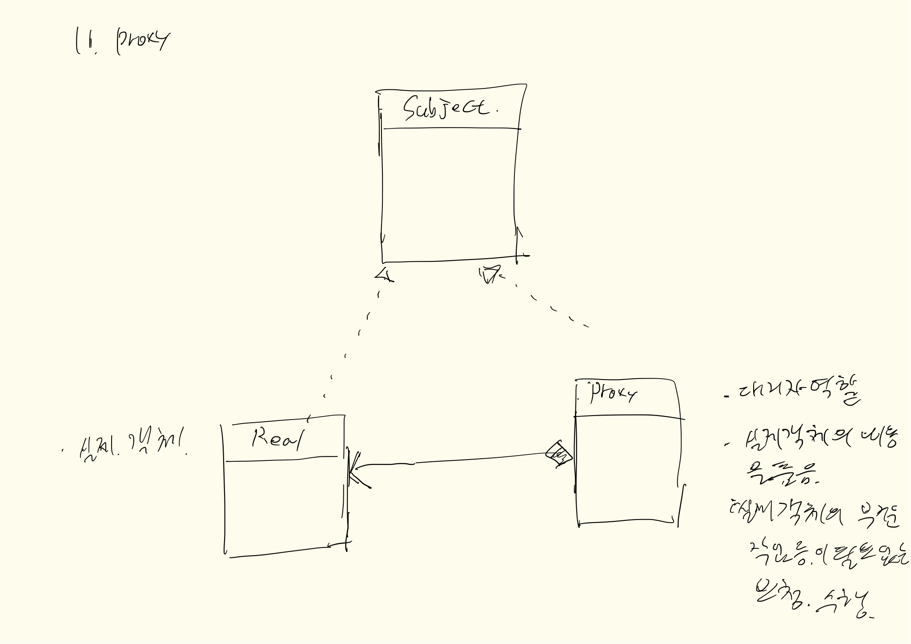
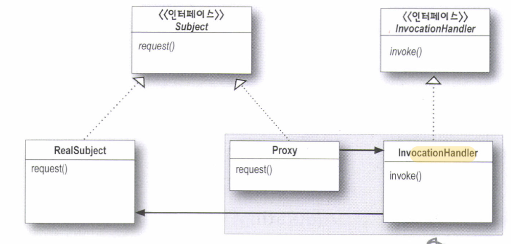

## 내용
프록시 패턴은 실제 객체가 해야할 일 을 대신 해주게 해주는 패턴이다.

다양한 변종이 많고, 응용이 그만큼 많은 패턴이라 할 수 있다. 근간이 되는 내용은  
아무래도 위임 개념인 것 같고, 이와 **비슷한 패턴인** `데코레이터, 어댑터 패턴`을 언급한다.

## 스터브와 스켈레톤
`스터브와 스켈레톤`은 클라이언트와 원격의 프록시라고 봐도 된다 RMI 기초개념에서 등장하는 용어이고,
중요한건 패턴의 쓰임새라고 생각한다.

## 언제 사용하나
- 실제 객체의 어떤 실행 작업이 무거운 경우를 제외한 나머지 일을 해야하는 경우등
- 실제 객체가 하는 일을 대신해서 해주게 하고자 할 때
- 원격, 가상, 보호 프록시 등의 형태로 사용되기도 함. 다양한 변종이 나타난다

 
### 추가적으로 알아야 할 부분
- RMI
- 원격프록시
- 가상프록시

- 데코레이터와 유사
- 어댑터와 유사하기도 함

- 보호 프록시  
  java.lang.reflect (동적프록시)
  
   
## 클래스다이어그램

---
변형내용

